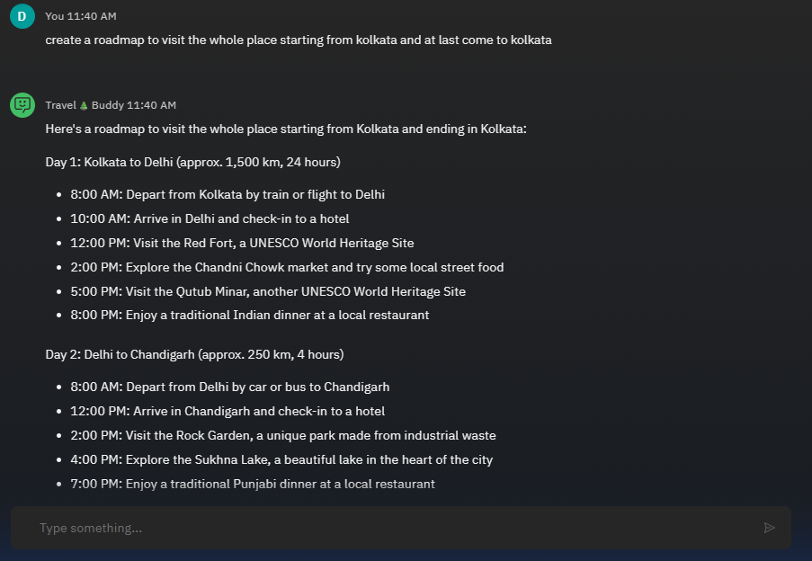
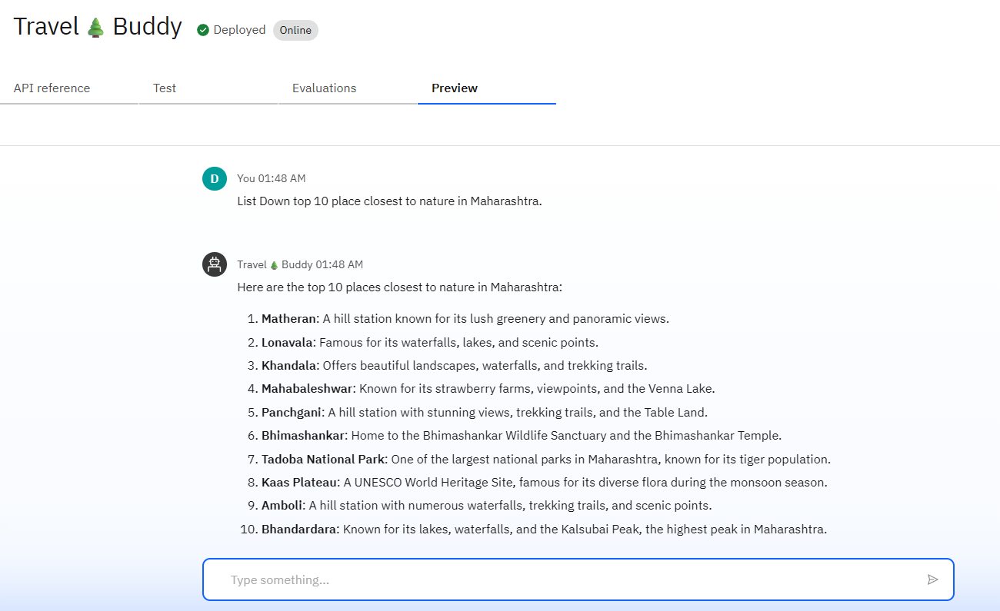
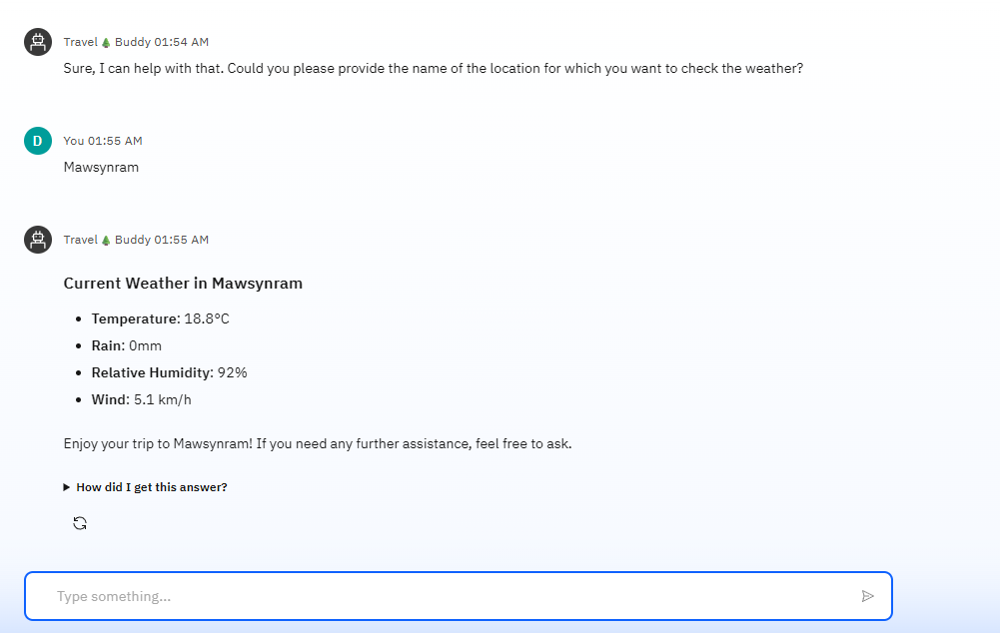

# 🤖 Travel🌲Buddy :[Travel Planner Agent]

- Travel🌲Buddy can help you to "Plan Your Next Destination". Desire destination, itinerary, budget, risk analysis, and consider no of days.
- It is an AI-powered assistant that helps users plan trips efficiently and intelligently.

---
---

## 🏕️ Deployment
- **Github Link** -- [Open Repository](https://github.com/saidulalimallick04/travel-buddy-travel-planner-agent.git)

---
---

## 🚀 Demo

Here’s a quick look at the AI Agent in action 👇
 


---
---

## ✨ Features
- 🧠 **Destination Suggestion** – Understand user’s preferences (budget, interests, season)  
- 🔍 **Itinerary Builder** – Identify trip length → Search attractions & timings → Create a day-wise plan → Adjust based on weather or time.
- 💬 **Transport Planning** – Search flight/train/bus options → Compare cost & duration.
- 🗺️ **Maps & Navigation** – Best route for you plan.  
- ☁️ **Weather Integration** – Weather update alerts.  
- 📊 **Local Guide & Cultural Info** – Local Cultural info.  
- 🏕️ **Booking Assistance** – Can provide booking assistance.  
- 🔔 **Alerts & Notifications** – Alert about weather and other if any.  
- 🚩 **Group Travel Planning** – Personalized Plan if you have a Group. 
- ❤️ **AI Storyteller Mode** – Unique short-story about every places..  

---
---

## 🛠️ Tech Stack

- **Frameworks**: ```LangGraph```
- **Architecture**: ```ReAct```
- **Database**: IBM Object Cloud
- **Model**: ```mistralai/mistral-large``` & ```meta-llama/llama-3-2-11b-vision-instruct```

---
---

## ⚙️Agent Workflow Overview


---
---

## 📷 Screenshots

| Agent UI Example                                                                        | Response Example                                                                      |
|-----------------------------------------------------------------------------------------|---------------------------------------------------------------------------------------|
|              |          |
|  |  |
|           |        | 
|               |            |
|               |               |

---
---

## 📜 License
<Currenty_undefined> 

---
---
## 👨‍💻 Author

|Profile                                                                                                   | Name                          | Role                                              | GitHub                                                            | LinkedIn                                                          | Leetcode                                                          | Youtube                                                           |
|----------------------------------------------------------------------------------------------------------|-------------------------------|---------------------------------------------------|-------------------------------------------------------------------|-------------------------------------------------------------------|-------------------------------------------------------------------|-------------------------------------------------------------------|
| [](https://github.com/saidulalimallick04)      | Saidul Ali Mallick (Sami)     | Backend Developer & AIML Engineer                 | [@saidulalimallick04](https://github.com/saidulalimallick04)      | [@saidulalimallick04](https://linkedin.com/in/saidulalimallick04) | [@saidulalimallick04](https://leetcode.com/u/saidulalimallick04)  |  [@saidulalimallick04](https://www.youtube.com)                   |

> ❤️ I believe in building impact, not just writing code.
---
---

